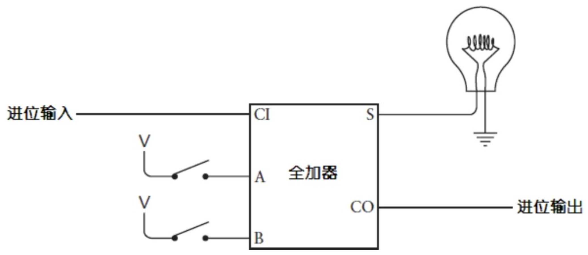
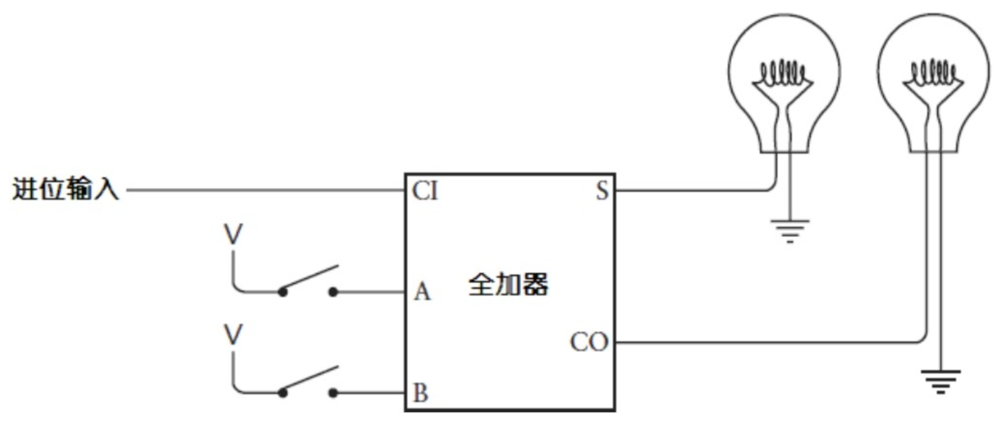
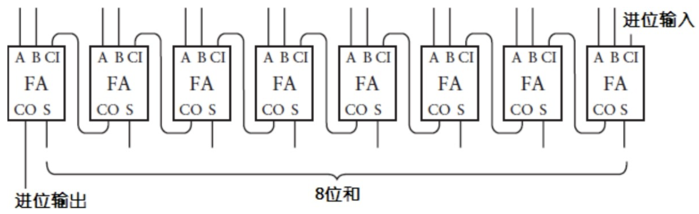

### 最终实现

这一小结，我们会通过全加器实现加法器。

当把两个二进制数相加时，第1列的处理方式与其他列有所不同。因为后面的几列可能包括来自前面加法的进位，而第1列不会，所以全加器的进位输入端是接地的，这表示第1列的进位输入是一个0。

对于中间的二进制位和灯泡，可以按如下办法来连接全加器：

最终，第8个灯泡和最后一对开关将以如下方式连接到全加法器上：

还可以用另一种方式来看这8个全加器的连接，每个全加器的进位输出都作为下一个全加器的进位输入：

加器器可以简化如下：

继续简化：

基于 8 位加法器，可以轻松实现 16 位加法器。

#### 拓展

使用代码模拟加法器
