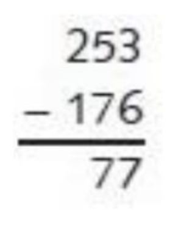
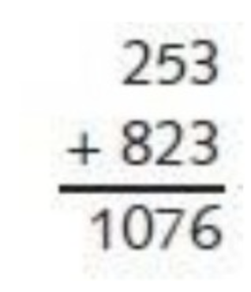

### 十进制减法

日常生活中用减法时，怎么避免借位呢？

**思考十秒...**

可以采用如下方式：

`253 - 176`

在这个式子中加上一个数再减去这个数，结果是相同的。因此先加上1000，再减去1000：

`253 - 176 + 1000 - 1000`

这个式子与下式等价：

`253 - 176 + 999 + 1 - 1000`

然后用以下方式将数字重新组合：

`253 + (999 - 176) + 1 - 1000`

用 `999` 减去目标数，则达到了不用借位的目标，如图：

第一步：

第二步：

第三步：

#### 思考

如果减数大于被减数会怎么样呢？上面的方式还行的通么？
