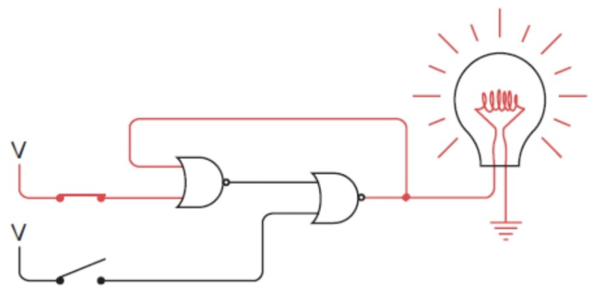

### 反馈

先前 加法器 和 减法器的电路相对简单，电流的流向是单向的，用代码也很好表达。

但显示生活中的电路远远没有这么简单，看看下面的例子：

值得注意的是这种特殊的弯曲的连线方式：左边或非门的输出是右边或非门的输入，而右边或非门的输出是左边或非门的输入。这种连接方式我们称之为反馈（feedback）。

反馈电路会带来一些神奇的特性 —— 它能记住输入的状态。

继续以上面的电路图为例：

在初始状态下，电路中只有左边的或非门输出电流，这是因为其两个输入均为0。让我们闭合上面的开关，左边或非门将立刻输出0，右边或非门的输出也会随之变为1，这时灯泡将被点亮。

奇妙的是，这时一旦你关闭上边的开关，灯炮依然闪闪发光。这是因为由于左边或非门的输入中有一个为1，其输出依然是0，因而左边或非门的输出不变，所以灯泡仍然亮着。

现在来试试闭合下面的开关。我们会发现右边或非门的输入中有一个立刻变为1，其输出就相应地变为0，灯泡随之熄灭。左边或非门的输出此刻变为1。

这时你再去断开下面的开关就会发现，灯泡一直处在熄灭状态。

我们可以发现上面的反馈电路可以记住用户最后闭合的是哪个开关。有内存的一些味道了。
