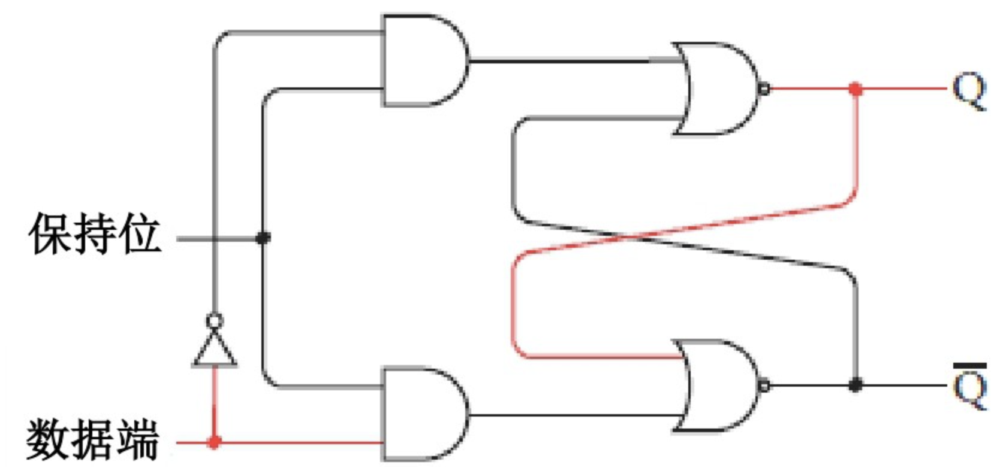

### 锁存器

前面的反馈电路相对简单，而且不太实用，现在设计一个更加通用的电路 —— 锁存器。

下图所表示的情况，可以看出只要保持位为0，电路输出就丝毫不受输入端的影响：

当保持位为1时，电路反映出数据端输入的值：

这时，电路会“记得”当保持位最后一次置1时数据端输入的值，数据端的变化对此没有影响。例如，数据端再置回0对输出将不会产生影响：

Q 与 横杠Q 的取值相反，在锁存器中，其实可以忽略 横杠Q，整理如下：

简化如下：

