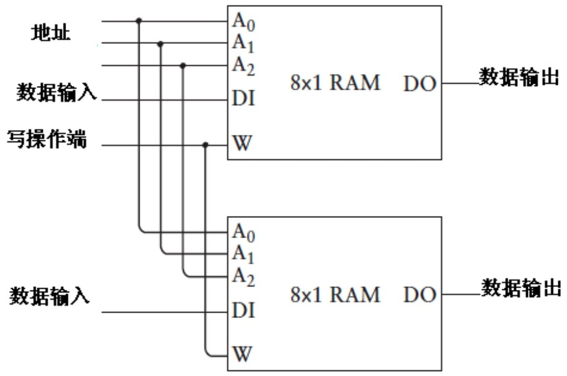
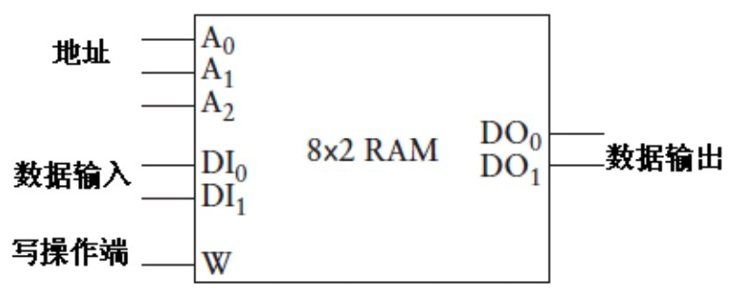
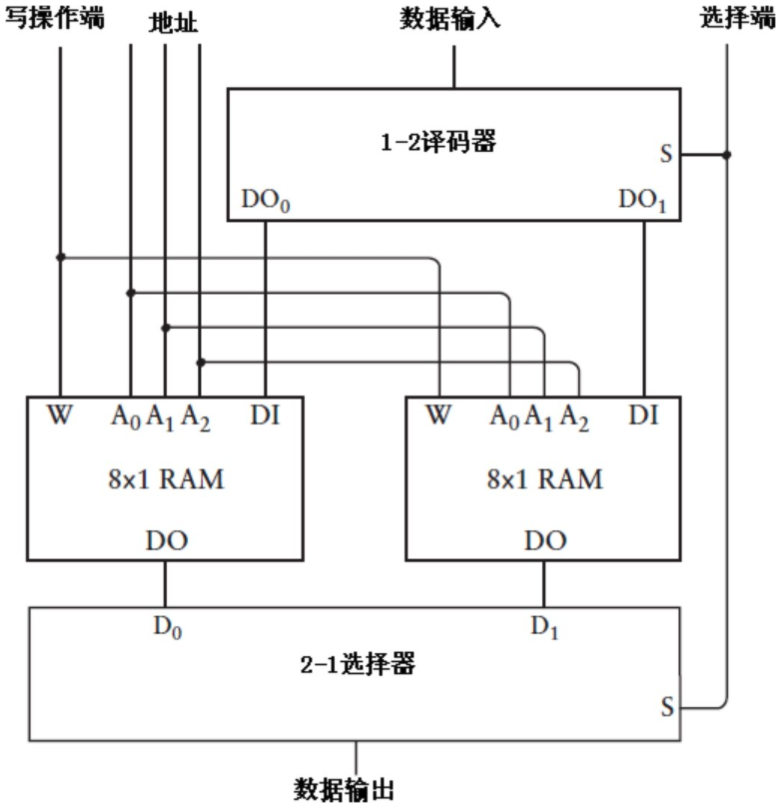
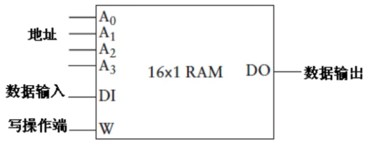
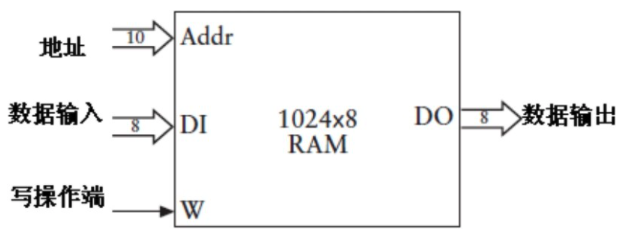

### RAM扩展

前面小节中，我们只实现了 8 bit, 也就是 1字节 的 RAM。这实际上远远不够，我们来做一下扩展。

#### 位宽扩展

我们把这两个8×1的RAM阵列的地址和输出都分别看成一个整体，这样就得到了一个8×2的 RAM阵列，如下图所示：

简化图如下：

这个RAM阵列可存储的二进制数依然是8个，但每个数的位宽为2位。

#### 地址数扩展

我们还可以把两个8×1的RAM阵列看做是两个锁存器，使用一个2-1选择器和一个1-2译码器就可以把它们按照单个锁存器连接方式进行集成，下图是实现方式：

“选择”端之所以连接到译码器和选择器，主要作用是在两个8×1 RAM阵列中选择一个，本质上它扮演了第4根地址线的角色。

于是这种结构实质上是一种 16×1 的RAM 阵列，简化图如下：

#### 最后

我们的 RAM 既能横向扩展，也能纵向扩展。那么，我们也能实现下面的 RAM：

