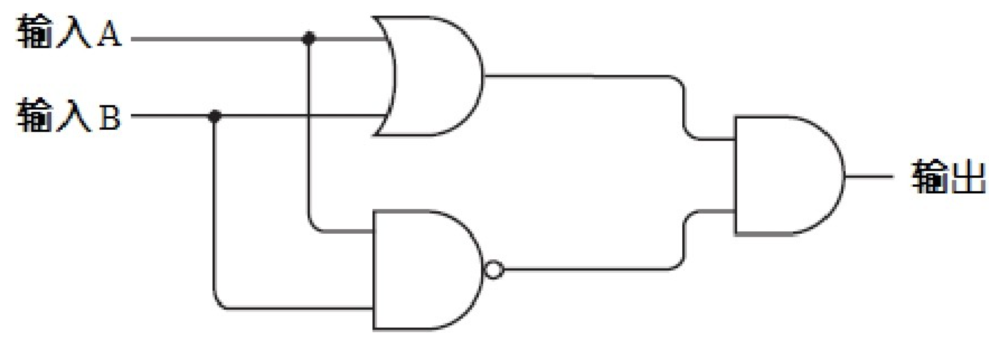

# 使用与门、或门、非门实现加法器和减法器

笔者的程序员生涯开始于一本书：《编码：隐匿在计算机软硬件背后的语言》；

依旧清晰记得大二暑假那年读完这本书后激动的心情和颤抖的手；在随后的大学生涯中，笔者开始接触编程，旁听计算机系同学的课，系统地自学 Java，最终在大四的时候顺利找到一份编程实习工作，踏上了程序员这条路。

如今温故知新，笔者准备用这篇文章，结合代码，引用书中**从零实现一个加法器和减法器**的例子，带领大家领略计算机的魅力以及这本书的精彩。

本文的目标是从电路开始讲起，基于电路知识实现每个编程语言中都存在的 `与 &&`、`或 ||`、`非 ！` 这三个逻辑门，再基于这三个逻辑门来实现一个二进制加法器和减法器；

本文会用 JavaScript 来模拟从逻辑门到加法器和减法器的过程，让我们现在开始吧！

## 前置知识

### 电路知识

#### 手电筒


手电筒大家都用过，上面的电路也非常简单，当导线连接在一起时，灯泡会亮；导线断开时，灯泡会熄灭；

#### 电流 & 电池

上面的灯泡会什么会亮？那是因为导线连接在一起时，会产生电流，电流经过灯泡时遇到电阻就会发光；

形象一点解释：可以把电流理解为管道里的水，把电池理解为抽水机，把灯泡理解为水力风车；

#### 地线

地球本身就是个大导体。

拿水流举例，地就表示大海；接地表示抽水机可以从大海里抽无穷的水，也可以排无穷的水。

##### 表示符号


##### 手电筒电路图简化


#### 电磁感应

当直流电通过导体时会产生磁场，而通过作成螺线管的导体时则会产生类似棒状磁铁的磁场。


#### 继电器

继电器用到了电磁感应原理；观察下图，当螺线管的导体通电后，会产生磁场，然后会吸引上方的开关向下，连通上方导线使小灯泡发光。


### 逻辑门知识

有了上面的电路知识，现在可以基于电路做作出各种逻辑门

#### 与门

只有当两个继电器都被触发的时候灯泡才会亮。这样两个继电器的串联被称为一个**与门**


简化符号如下：


与门的输入与输出之间的关系同样可用下表来描述:


用 JS 可以表示如下：

```js
const AND = (a, b) => {
  return a && b;
};
```

#### 或门

两个继电器任意一个被触发的时候灯泡就会亮。这样两个继电器的并联被称为一个**或门**


简化符号如下：


或门的输入与输出之间的关系同样可用下表来描述:


用 JS 可以表示如下：

```js
const OR = (a, b) => {
  return a || b;
};
```

#### 非门

**非门**又称**反向器**；输入端有电流时，输出端没电流；输入端没电流时，输出端有电流；


简化符号如下：


用 JS 可以表示如下：

```js
const NO = (a) => {
  return !a;
};
```

#### 与非门

**与非门**的输出和**与门**相反，可以用**与门**和**非门**串联得到；

简化符号如下：


与非门的输入与输出之间的关系同样可用下表来描述:


用 JS 可以表示如下：

```js
const NAND = (a, b) => {
  return NO(AND(a, b));
};
```

#### 或非门

**或非门**的输出和**或门**相反，可以用**或门**和**非门**串联得到；

简化符号如下：


或非门的输入与输出之间的关系同样可用下表来描述:


用 JS 可以表示如下：

```js
const NOR = (a, b) => {
  return NO(OR(a, b));
};
```

#### 异或门

我们还需要一个很重要的门 —— **异或门**

异或门可以通过之前已经实现的其他门来组装实现，电路图如下：



电路输出结果如下：


可以发现当输入 A 和输入 B 中有且只有一个有电流进入时，才会有电流输出；

**异或门**的简化符号如下：


异或门的输入与输出之间的关系同样可用下表来描述：


用 JS 可以表示如下：

```js
const XOR = (a, b) => {
  return AND(OR(a, b), NAND(a, b));
};
```

经过努力，我们已经基于电路实现了 **与门**、**或门**、**非门**，并基于这三个基础门进一步得到了 **或非门**、**与非门**、**异或门**，非常棒，接下来我们会基于这些逻辑门实现加法。

## 实现加法器

加法是算术运算中最基本的运算，因此如果想搭建一台计算机，那么首先要造出可以计算两个数和的工具。如果深入计算机底层，你会发现，加法计算是计算机要做的唯一工作。如果我们可以造出加法器，同样地，就可以利用加法来实现减法、乘法和除法。

我们要实现的，就是类似于下方的加法器控制面板：


### 半加器

首先要实现一个**半加器**，半加器的目标是实现**两个一位二进制之间的相加**。

电路图如下：


可以简化如下：


用 JS 可以表示如下：

```js
const HalfAdder = (a, b) => {
  return [XOR(a, b), AND(a, b)];
};
```

但是半加器也只能做 1 位二进制之间的加法，功能有限，要实现目标中的加法器，还需要基于半加器实现全加器。

### 全加器

全加器相对于半加器多了一个进位输入，这为全加器的串联从而实现多位加二进制加法提供了可能。

电路图如下：


以下表格总结了全加法器所有可能的输入组合以及对应的输出结果：


全加器可以简化如下：


用 JS 可以表示如下：

```js
const FullAdder = (ci, a, b) => {
  const [s1, co1] = HalfAdder(a, b);
  const [s2, co2] = HalfAdder(s1, ci);
  return [s2, OR(co1, co2)];
};
```

### 最终实现

有了全加器，我们就可以很方便的实现多位加二进制加法了。

要注意，当把两个二进制数相加时，第 1 列的处理方式与其他列有所不同。因为后面的几列可能包括来自前面加法的进位，而第 1 列不会，所以全加器的进位输入端是接地的，这表示第 1 列的进位输入是一个 0。


对于中间的二进制位和灯泡，可以按如下办法来连接全加器：


最终，第 8 个灯泡和最后一对开关将以如下方式连接到全加法器上：


还可以用另一种方式来看这 8 个全加器的连接，每个全加器的进位输出都作为下一个全加器的进位输入：


加器器可以简化如下：


继续简化：


基于 8 位加法器，可以通过串联轻松实现 16 位加法器。


### 代码实现加法器

有了上面铺垫，可以很轻松地用代码模拟八位加法器：

```js
const EightBitAdder = (arr1, arr2) => {
  const [a7, a6, a5, a4, a3, a2, a1, a0] = arr1;
  const [b7, b6, b5, b4, b3, b2, b1, b0] = arr2;
  const [s0, co0] = FullAdder(false, a0, b0);
  const [s1, co1] = FullAdder(co0, a1, b1);
  const [s2, co2] = FullAdder(co1, a2, b2);
  const [s3, co3] = FullAdder(co2, a3, b3);
  const [s4, co4] = FullAdder(co3, a4, b4);
  const [s5, co5] = FullAdder(co4, a5, b5);
  const [s6, co6] = FullAdder(co5, a6, b6);
  const [s7, co7] = FullAdder(co6, a7, b7);
  return [+co7, +s7, +s6, +s5, +s4, +s3, +s2, +s1, +s0];
};
```

测试一下效果：

```js
console.log(EightBitAdder([0, 1, 1, 0, 0, 1, 0, 1], [1, 0, 1, 1, 0, 1, 1, 0]));

// [1, 0, 0, 0, 1, 1, 0, 1, 1]
```

最终的加法器的完整代码如下，可以看到代码中**只用了逻辑门，没有用一个数学运算符，便实现了加法运算**：

```js
// 与门
const AND = (a, b) => {
  return a && b;
};

// 或门
const OR = (a, b) => {
  return a || b;
};

// 非门
const NO = (a) => {
  return !a;
};

// 或非门
const NOR = (a, b) => {
  return NO(OR(a, b));
};

// 与非门
const NAND = (a, b) => {
  return NO(AND(a, b));
};

// 异或门
const XOR = (a, b) => {
  return AND(OR(a, b), NAND(a, b));
};

/**
 * 半加器
 *
 * @returns [加加输出, 进位输出]
 */
const HalfAdder = (a, b) => {
  return [XOR(a, b), AND(a, b)];
};

/**
 * 全加器
 *
 * @param {*} ci 进位输入
 * @param {*} a 输入
 * @param {*} b 输入
 * @returns [加加输出, 进位输出]
 */
const FullAdder = (ci, a, b) => {
  const [s1, co1] = HalfAdder(a, b);
  const [s2, co2] = HalfAdder(s1, ci);
  return [s2, OR(co1, co2)];
};

// 八位加法器
const EightBitAdder = (arr1, arr2) => {
  const [a7, a6, a5, a4, a3, a2, a1, a0] = arr1;
  const [b7, b6, b5, b4, b3, b2, b1, b0] = arr2;
  const [s0, co0] = FullAdder(false, a0, b0);
  const [s1, co1] = FullAdder(co0, a1, b1);
  const [s2, co2] = FullAdder(co1, a2, b2);
  const [s3, co3] = FullAdder(co2, a3, b3);
  const [s4, co4] = FullAdder(co3, a4, b4);
  const [s5, co5] = FullAdder(co4, a5, b5);
  const [s6, co6] = FullAdder(co5, a6, b6);
  const [s7, co7] = FullAdder(co6, a7, b7);
  return [+co7, +s7, +s6, +s5, +s4, +s3, +s2, +s1, +s0];
};
```

## 实现减法器

接下来来实现减法器，我们要实现的，就是类似于下的减法器控制面板：


之前的加法器可以通过进位很轻松的完成计算；

但是在减法中没有进位，而是有借位，这就很麻烦；借位是一种与加法存在本质区别的麻烦机制。

### 先看看十进制减法

日常生活中用减法时，怎么避免借位呢？


**思考十秒...**

可以采用如下方式：

`253 - 176`

在这个式子中加上一个数再减去这个数，结果是相同的。因此先加上 1000，再减去 1000：

`253 - 176 + 1000 - 1000`

这个式子与下式等价：

`253 - 176 + 999 + 1 - 1000`

然后用以下方式将数字重新组合：

`253 + (999 - 176) + 1 - 1000`

用 `999` 减去目标数，则达到了不用借位的目标，如图：

第一步：


第二步：


第三步：


### 在看看二进制减法

有了上面 十进制减法 的基础，现在来看看 二进制 减法。


第一步，用 11111111（即 255）减去减数：


这其实就是是计算机中的 **补码**

第二步，将减数对 1 的补数与被减数相加：


第三步，将上式所得结果加 1：


第四步，减去 100000000（即 256）：


结果就等于十进制数的 77。

### 求补器

上面提到了**补码**的概念，相当于对每位取反，因此我们计算 8 位二进制数补数的时候可以简单地用 8 个反向器：


问题是，该电路只会对输入求反，而我们要的是一台既能做加法又能做减法的机器，因此就要求该电路仅当进行减法运算时才实现反转。电路可以改造为如下图所示：


简化图如下：


用 JS 可以表示如下：

```js
const Complementer = (sub, arr) => {
  const [a7, a6, a5, a4, a3, a2, a1, a0] = arr;
  return [
    XOR(sub, a7),
    XOR(sub, a6),
    XOR(sub, a5),
    XOR(sub, a4),
    XOR(sub, a3),
    XOR(sub, a2),
    XOR(sub, a1),
    XOR(sub, a0),
  ];
};
```

### 最终实现


注意，这里三个信号都标识为“SUB”，这就是加/减法转换开关。当该信号为 0 的时候，其进行的是加法运算，为 1 时进行的则是减法运算。在减法中，输入 B（第二排开关）在送入加法器之前，需先通过求补电路进行取反。此外，在做减法时，我们通过设定 CI（进位输入）为 1 来使得结果加 1。而在加法中，求补电路将不起作用，且输入 CI 为 0。

用 JS 可以表示如下：

```js
const EightBitMinus = (arr1, arr2) => {
  const [a7, a6, a5, a4, a3, a2, a1, a0] = arr1;
  const [b7, b6, b5, b4, b3, b2, b1, b0] = Complementer(true, arr2);
  const [s0, co0] = FullAdder(true, a0, b0);
  const [s1, co1] = FullAdder(co0, a1, b1);
  const [s2, co2] = FullAdder(co1, a2, b2);
  const [s3, co3] = FullAdder(co2, a3, b3);
  const [s4, co4] = FullAdder(co3, a4, b4);
  const [s5, co5] = FullAdder(co4, a5, b5);
  const [s6, co6] = FullAdder(co5, a6, b6);
  const [s7, co7] = FullAdder(co6, a7, b7);
  const co = XOR(true, co7);
  return [+co, +s7, +s6, +s5, +s4, +s3, +s2, +s1, +s0];
};
```

测试一下效果：

```js
console.log(EightBitMinus([1, 1, 1, 0, 1, 0, 0, 0], [0, 1, 0, 1, 0, 1, 0, 1]));

// [0, 1, 0, 0, 1, 0, 0, 1, 1]
```

## 总结

本文从基础电路开始，实现了 **与门**、**或门**、**非门**、**或非门**、**与非门**、**异或门** 这些基础的逻辑门，再基于这些逻辑门，实现了一个简单的加法器和减法器，并给出了相应的代码实现；整体可以看到代码中**只用了逻辑门，没有用一个数学运算符，便实现了加法和减法运算**。

本文只是抛砖引玉，希望能给到对计算机感兴趣的同学一点点启发。

实际上，《编码》这本书中还有其他非常精彩的部分，例如寄存器的实现，强烈建议感兴趣的同学读一读原书，点击[这里](https://github.com/WangYuLue/simple-code/blob/main/assets/%E7%BC%96%E7%A0%81%EF%BC%9A%E9%9A%90%E5%8C%BF%E5%9C%A8%E8%AE%A1%E7%AE%97%E6%9C%BA%E8%BD%AF%E7%A1%AC%E4%BB%B6%E8%83%8C%E5%90%8E%E7%9A%84%E8%AF%AD%E8%A8%80%EF%BC%88%E7%BE%8E.%E4%BD%A9%E6%8E%AA%E5%B0%94%E5%BE%B7%EF%BC%89.pdf)可以下载。
